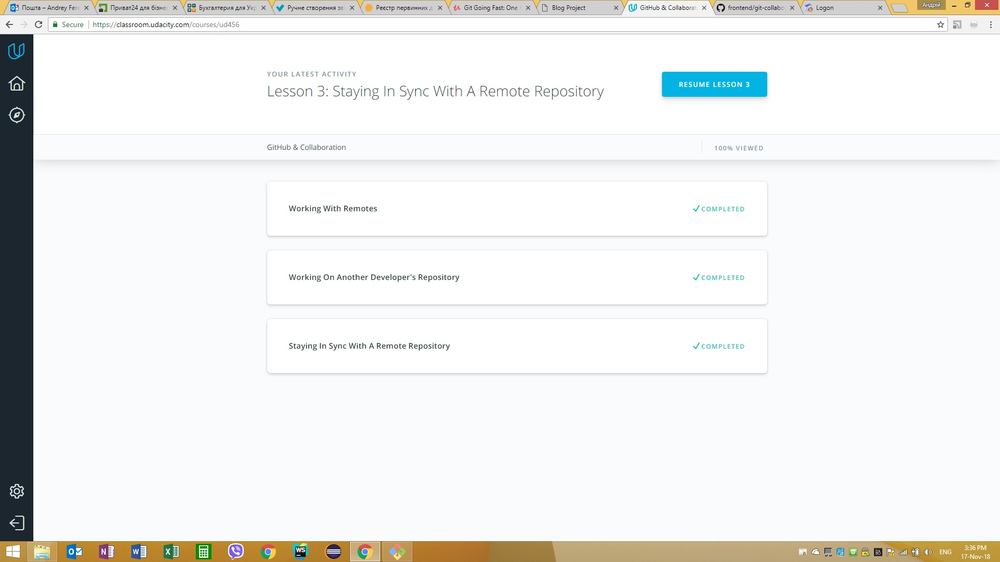
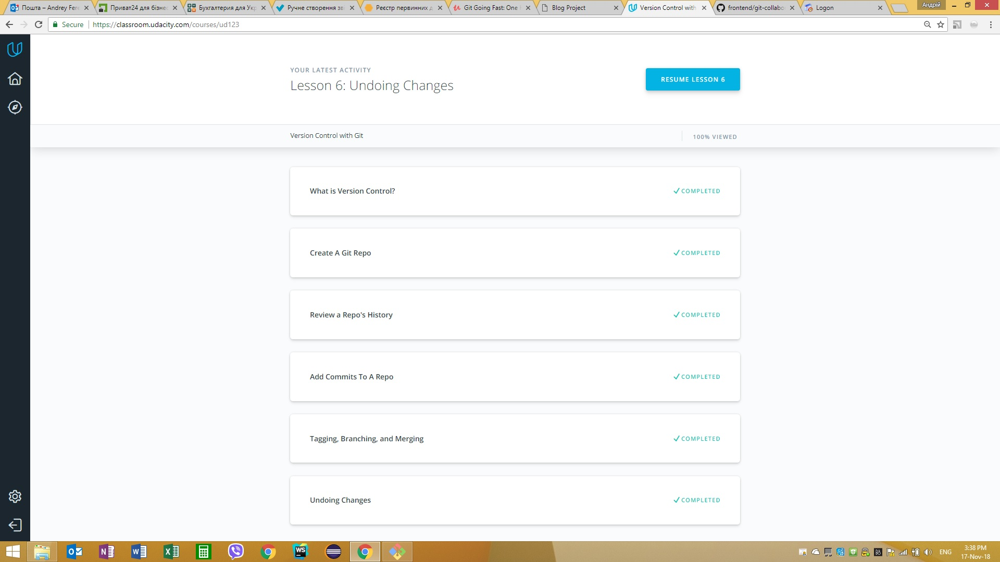
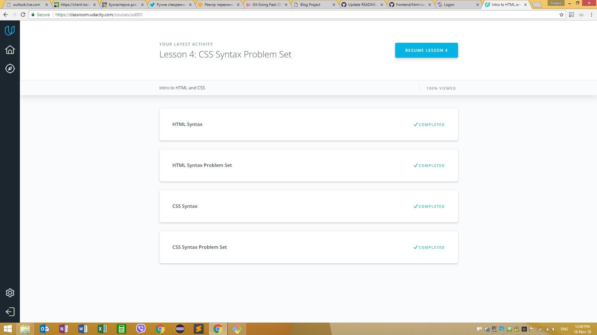
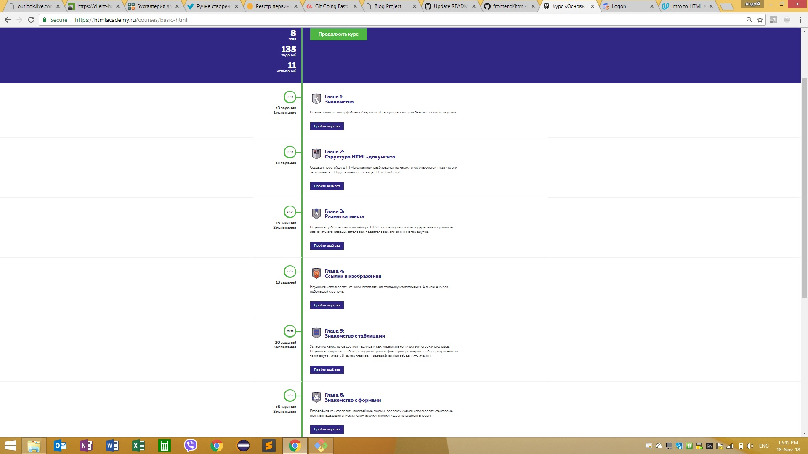
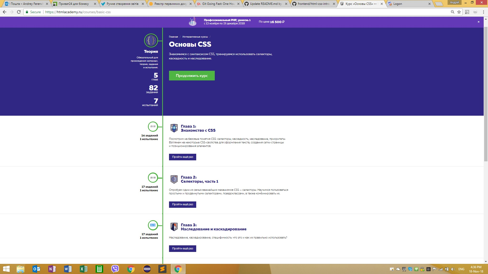
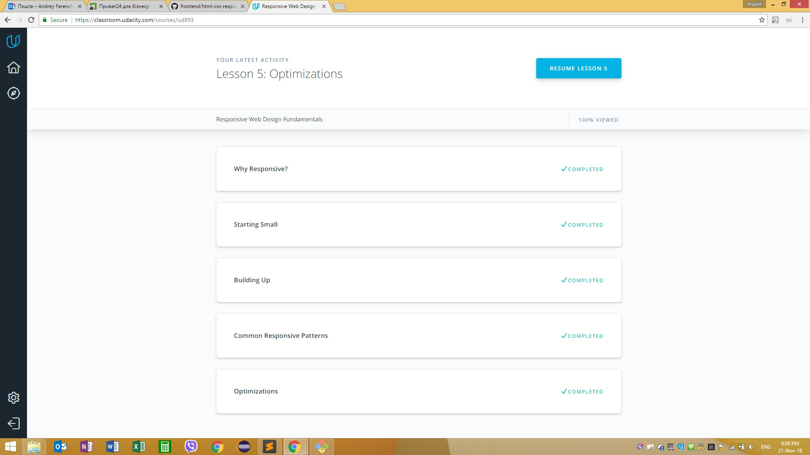
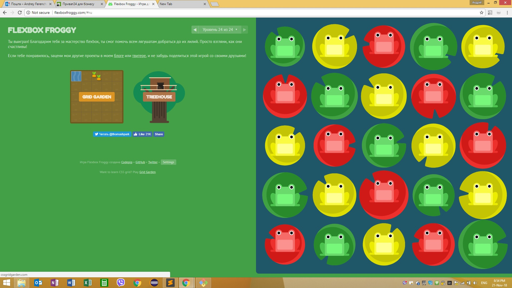

# kottans-frontend

Any time I started learning I stumbled in using git and command line and I had been thinking: "why did not start with these things?"
So I think it is the right place for me )

Now it seems that I now how to work with a command line

## Linux CLI, and HTTP

 Embedding a screenshot was really hard )

## Git Collaboration

The information in finished courses was very interesting and useful, all thing are very surprising and Im going to use it all comleately.

## Intro to HTML and CSS

I did all of those once before

## Responsive Web Design

Responsive web design is very cool thing. Froggy was fun )