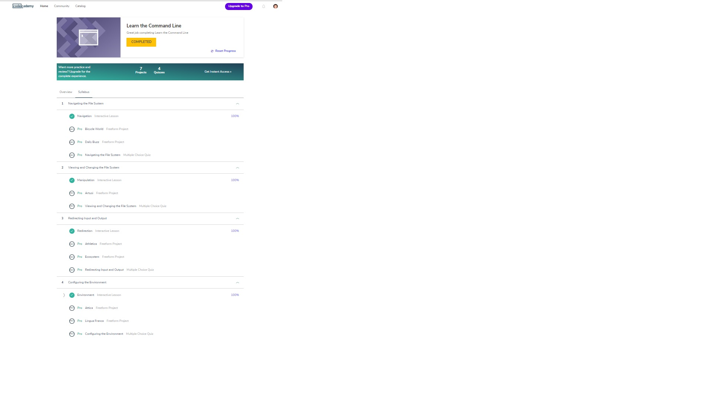

# kottans-frontend
somethingThatIDidNotGetYet

Any time I started learning I stumbled in using git and command line and I had been thinking: "why did not start with these things?"
So I think it is the right place for me )

Now it seem that I now how to work with command line

## Linux CLI, and HTTP

        kottans-frontend/task_linux_cli/cli screen.png

     

     